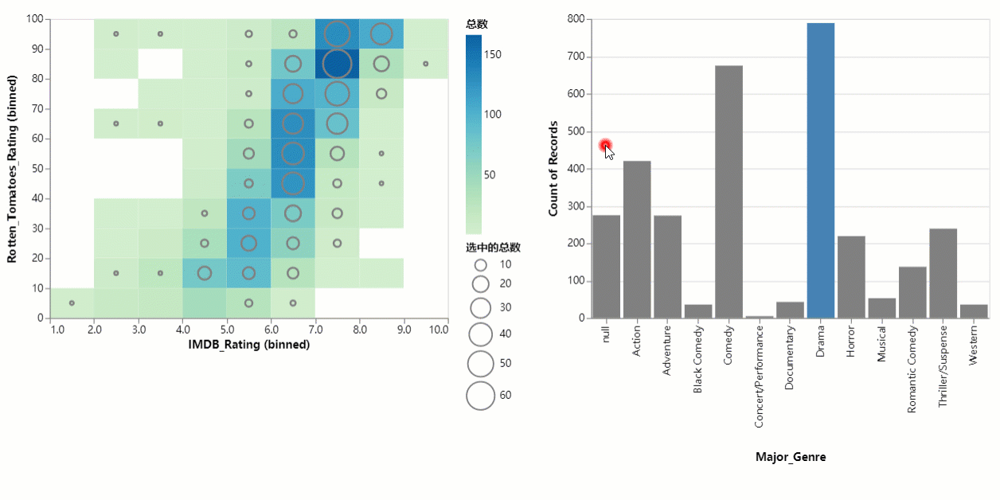

# VegaSharp
a .NET port of Vega


# 效果
`Vega`、`Vega-lite` 使得可以用`json`描述图表可视化，`VegaSharp`基于此，能让你使用声明方式作出数据可视化图表。

---

[Winform示例](src/CrystalWind.VegaSharp.WindowsFormsSamples)

---
多表联动：



# 教程


## 前提
Nuget 安装：
```shell

```

---
所需命名空间：
```C#
using CrystalWind.VegaSharp;
using CrystalWind.VegaSharp.VegaMode;
```


---
## 快速入门
生成一个图表基本3要素：
- 1. 设置数据(Data)
- 2. 设置图标形状(Mark)
- 3. 设置数据映射(Encoding)

```C#
var names = "a b c d e f g h i".Split(" ");
var values = new[] { 28, 55, 43, 91, 81, 53, 19, 87, 52 };
var source = names.Zip(values, (f, s) => new { name = f, value = s });

Vega.SetData(source)
    .SetMark(Vega.Marks.Bar)
    .SetEncoding(x: "name:N", y: "value:Q")
    .ToFile("res.html");
```
- `Vega`类提供大部分便捷方式的调用
- `Vega.SetData`方法设置数据源
- `Vega.SetMark`方法设置图表形状，`Vega.Marks`中提供所有的图表类型
- `Vega.SetEncoding`方法设置数据映射
- `.ToFile("res.html")`生成html文件


---
以上3个的执行顺序不是强制，因此可以方便批量制作同类型不同维度的图表：
```C#
var rnd = new Random(42);
var source = from i in Enumerable.Range(1, 10)
                select new
                {
                    name = $"A{i}",
                    salse = rnd.Next(50, 200)
                };

var setting = Vega.SetData(source)
                    .SetEncoding(x: "name:N", y: "salse:Q");

var line = setting.SetMark(Vega.Marks.Line);
var bar = setting.SetMark(Vega.Marks.Bar);

(bar + line).ToFile("res.html");
```
- 使用相同的数据映射，最后分别制作出折线图和柱状图
- `bar + line`：2个图表相加`+`，能把图表重叠在一起

---
## Data
`VegaSharp` 能支持多种形式的数据，并且是可扩展。如下使用匿名对象集合作为数据：
```C#
var names = "a b c d e f g h i".Split(" ");
var values = new[] { 28, 55, 43, 91, 81, 53, 19, 87, 52 };
var source = names.Zip(values, (f, s) => new { name = f, value = s });


Vega.SetData(source)
    ………………
```
- 通过`Vega`顶级对象静态方法`SetData`传入数据

---
此外，还能直接使用 url(这是vega-lite内置)：
```C#
var url = @"https://vega.github.io/vega-datasets/data/movies.json";

Vega.SetData(url)
    ………………
```
---

## Mark


## Encoding


## 条件


## 交互


# 开发设计资料
- [vega-lite官网](https://vega.github.io/vega-lite/)